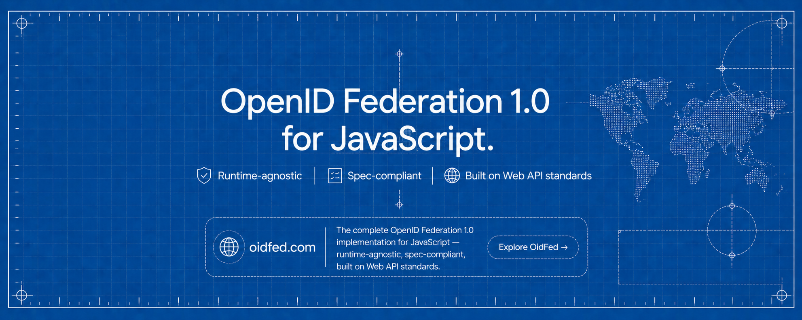

<div align="center">

<a href="https://oidfed.com">
	
</a>

# @oidfed/* — OpenID Federation 1.0

The complete [OpenID Federation 1.0](https://openid.net/specs/openid-federation-1_0.html) implementation for JavaScript — runtime-agnostic, spec-compliant, built on Web API standards. Trust chain resolution and validation, metadata policy enforcement, trust marks, constraint checking, and automatic and explicit client registration — split across four focused packages built on Web API primitives (`Request → Response`), running anywhere JavaScript runs: Node.js, Deno, Bun, and beyond. All persistent state is behind pluggable storage interfaces, keeping database and HSM integrations entirely outside the core packages. The only runtime dependencies are [`jose`](https://github.com/panva/jose) and [`zod`](https://github.com/colinhacks/zod). Two operational utilities — a CLI and a browser-based explorer — complete the toolchain.

[Explorer](https://explore.oidfed.com) · [Project Home](https://oidfed.com) · [Learn OpenID Federation](https://learn.oidfed.com)

</div>

> [!IMPORTANT]
> **Spec:** Full [OpenID Federation 1.0](https://openid.net/specs/openid-federation-1_0.html) implementation · 
> 
> **Crypto:** All JOSE operations delegated to [`jose`](https://github.com/panva/jose) · 
> 
> **Status:** `v0.2.0` pre-release — API may change before the first stable `1.0` release.

---

```
                    Trust Anchor                 ← @oidfed/authority
                   ╱             ╲
       Intermediate               Intermediate   ← @oidfed/authority
            │                          │
   OpenID Provider             OpenID Provider   ← @oidfed/authority + @oidfed/oidc
            │                          │
    Relying Party               Relying Party    ← @oidfed/leaf + @oidfed/oidc

    @oidfed/core underlies every node in the graph
```

---

## Packages

| Package | Role | Install when building a… | Docs |
|---------|------|--------------------------|------|
| `@oidfed/core` | Federation primitives — entity statements, trust chain resolution, metadata policy, and cryptographic verification. The foundational layer of the complete OpenID Federation 1.0 implementation | Any federation participant | [docs/packages/core.md](docs/packages/core.md) |
| `@oidfed/authority` | Trust Anchor and Intermediate Authority operations — subordinate management, statement issuance, federation endpoint serving, and policy enforcement | Trust Anchor or Intermediate Authority | [docs/packages/authority.md](docs/packages/authority.md) |
| `@oidfed/leaf` | Leaf Entity toolkit — Entity Configuration serving, authority discovery, and trust chain participation for any entity at the edge of an OpenID Federation | Relying Party | [docs/packages/leaf.md](docs/packages/leaf.md) |
| `@oidfed/oidc` | OpenID Connect and OAuth 2.0 federation flows — automatic and explicit client registration, Request Object validation, and RP/OP metadata processing as defined in OpenID Federation 1.0 | OP or RP | [docs/packages/oidc.md](docs/packages/oidc.md) |

For integration examples, see the [Wiring Guide](docs/guide/wiring-guide.md). For production storage backends (PostgreSQL, MongoDB, Redis) and HSM key stores, see the [Storage Guide](docs/guide/storage-guide.md). To run a full multi-topology federation locally with wildcard DNS and TLS, see the [Dev Guide](docs/guide/dev.md) and [E2E Test infrastructure](docs/test/e2e.md).

The repository also ships a CLI ([`@oidfed/cli`](docs/tools/cli.md)), a live federation explorer at [explore.oidfed.com](https://explore.oidfed.com), an interactive course at [learn.oidfed.com](https://learn.oidfed.com), and a few internal packages that support the workspace — browse the source or the [docs/](docs/) directory to learn more.

## Related Specifications

[OpenID Federation 1.0](https://openid.net/specs/openid-federation-1_0.html) is protocol-agnostic by design, though it includes OAuth 2.0 and OpenID Connect entity types and registration flows. The specification authors are refactoring it into two successor draft documents (referenced in [§17.6](https://openid.net/specs/openid-federation-1_0.html#section-17.6)):

| Specification | Scope |
|--------------|-------|
| [**OpenID Federation 1.1**](https://openid.net/specs/openid-federation-1_1.html) *(draft)* | Protocol-independent layer — Entity Statements, Trust Chains, Metadata, Policies, Trust Marks, Federation Endpoints |
| [**OpenID Federation for OpenID Connect 1.1**](https://openid.net/specs/openid-federation-connect-1_1.html) *(draft)* | Protocol-specific layer — OAuth 2.0 / OpenID Connect entity types, client registration flows |
| [**OpenID Federation Wallet Architectures 1.0**](https://openid.net/specs/openid-federation-wallet-1_0.html) *(draft)* | Trust establishment for Wallet ecosystems with OpenID Federation |
| [**OpenID Federation Extended Listing 1.0**](https://openid.net/specs/openid-federation-extended-listing-1_0.html) *(draft)* | Subordinate Listings Specification for large-scale federations |


> [!NOTE]
The two 1.1 draft documents together are equivalent to OpenID Federation 1.0. The Wallet Architectures and Extended Listing specs are independent extensions. This library targets the OpenID Federation 1.0 final specification & may add support for any of the successor and profiles of the core spec including current successors and profiles such as the 1.1 drafts, the Wallet Architectures, and Extended Listing.

For real-world integration examples see the [Wiring Guide](docs/guide/wiring-guide.md), the [dev federation server](docs/guide/dev.md), and the [E2E test infrastructure](docs/test/e2e.md).

## Federation Operator Notes

Running a federation involves responsibilities beyond what this library enforces. Operators **MUST** read and address:

- [**§18 — Security Considerations**](https://openid.net/specs/openid-federation-1_0.html#section-18): DoS prevention for the resolve, fetch, and registration endpoints; `authority_hints` depth limits; Trust Mark filtering; reverse-proxy end-to-end signing.
- [**§19 — Privacy Considerations**](https://openid.net/specs/openid-federation-1_0.html#section-19): Entity Statements are org-level infrastructure — keep personal data minimal; mitigate Trust Mark Status and Fetch endpoint tracking via short-lived tokens and static Trust Chains.
- [**§17 — Implementation Considerations**](https://openid.net/specs/openid-federation-1_0.html#section-17): Multi-path topology ambiguity; Trust Mark policy design; resolver and Trust Anchor co-location.

This library provides the protocol mechanisms; policy, rate limiting, key management, HSM integration, and operational hardening are the operator's responsibility.

## Security

To report a vulnerability, email **dah.kenangnon@gmail.com** — see [SECURITY.md](SECURITY.md) for the full disclosure policy.

## License

@oidfed is dual-licensed by component:

- **Libraries** — `@oidfed/core`, `@oidfed/authority`, `@oidfed/leaf`, `@oidfed/oidc`, `@oidfed/cli` — released under [Apache License 2.0](LICENSE).
- **Apps & internal UI** — `@oidfed/explorer`, `@oidfed/home`, `@oidfed/learn`, `@oidfed/ui` — released under MIT. See each component's own `LICENSE` (e.g. `apps/home/LICENSE`).

The repository root is governed by the Apache 2.0 `LICENSE` file. Apps and internal packages override this with their own MIT `LICENSE` file. Refer to the `LICENSE` in the nearest parent directory of any file to determine its license.

Copyright © 2026-Present [Justin Dah-kenangnon](https://github.com/Dahkenangnon).
